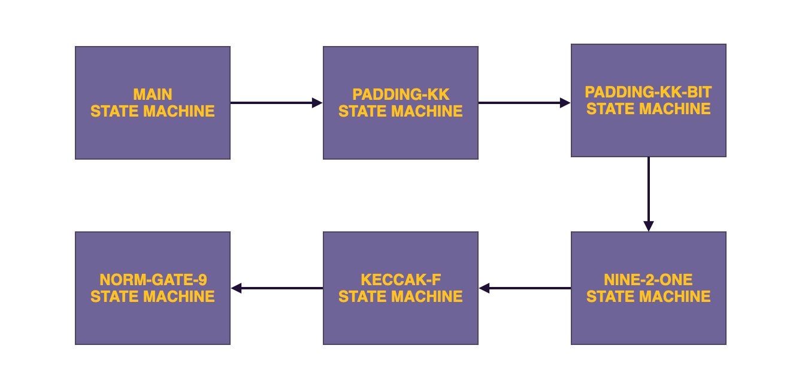

## Keccak Framework In The zkEVM

The zkEVM, as a L2 zk-rollup for Ethereum, utilises the Keccak hash function in order to achieve seamless compatibility with the Layer 1, the Ethereum blockchain.

However, instead of implementing the Keccak-256 hash function as one state machine, the zkEVM does this in a framework consisting of a few state machines. These state machines (SMs) are; 

1. The Padding-KK SM [sm_paddingkk.js](https://github.com/0xPolygonHermez/zkevm-proverjs/blob/71646ae9c36080c9b7b5317c92b3caaaac603182/src/sm/sm_padding_kk.js) is used for padding purposes, as well as validation of hash-related computations pertaining to the Main SM's queries.
2. The Padding-KK-Bit SM [sm_padding_kkbit.js](https://github.com/0xPolygonHermez/zkevm-proverjs/blob/71646ae9c36080c9b7b5317c92b3caaaac603182/src/sm/sm_padding_kkbit/sm_padding_kkbit.js) converts between two string formats, the bytes of the Padding-KK SM to the bits of the Keccak-f Hashing SM, and vice-versa.
3. The Nine-2-One SM, [sm_nine2one.js](https://github.com/0xPolygonHermez/zkevm-proverjs/blob/71646ae9c36080c9b7b5317c92b3caaaac603182/src/sm/sm_nine2one.js), is used specifically for parallelizing implementation of the Keccak-f SM. It operates  like a multiplexer of sorts between the Padding-KK-Bit SM and the Keccak-f SM. The Nine-2-One SM ensures correct packing of bits from $9$ different blocks of the Padding-KK-Bit SM into a single $9$-bit $\mathtt{field9}$ element. 
4. The Keccak-f SM, [sm_keccakf.js](https://github.com/0xPolygonHermez/zkevm-proverjs/blob/main/src/sm/sm_keccakf/sm_keccakf.js), which computes hashes of strings at the request of the Main SM. Although the Keccak-f SM is a binary circuit, instead of executing on a bit-by-bit basis, it executes on a 9bits-by-9bits basis. This is tantamount to running $9$ hashing circuits in parallel.
5. The Norm-Gate-9 SM, [sm_norm_gate9.js](https://github.com/0xPolygonHermez/zkevm-proverjs/blob/71646ae9c36080c9b7b5317c92b3caaaac603182/src/sm/sm_norm_gate9.js), performs all normalised-XOR gate operations as required by the Keccak-f SM.

<b> Figure _: Keccak State Machine Design Schema </b>

