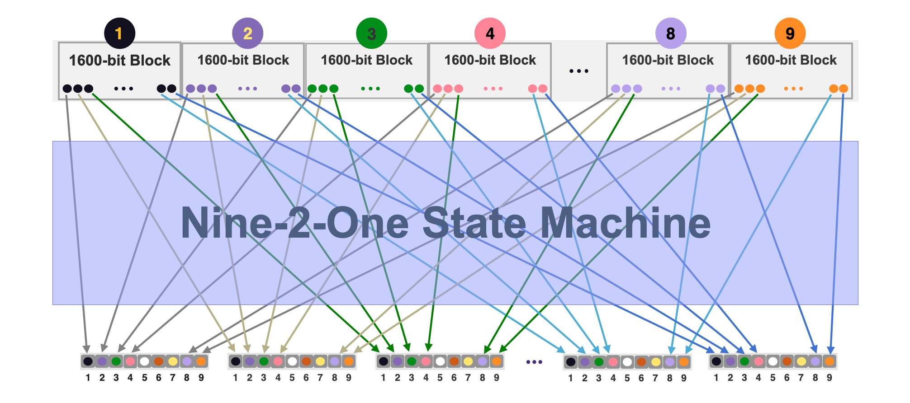
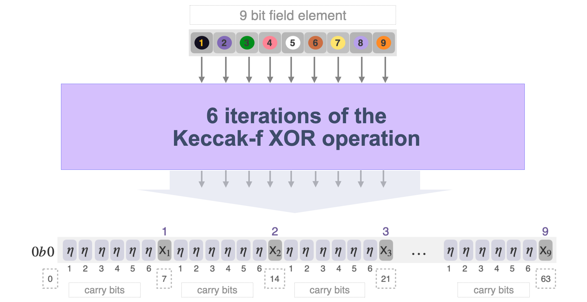

# Nine2One State Machine


The Nine-2-One State Machine, [sm_nine2one.js](https://github.com/0xPolygonHermez/zkevm-proverjs/blob/71646ae9c36080c9b7b5317c92b3caaaac603182/src/sm/sm_nine2one.js), is one of the auxiliary state machines used specifically for parallelising implementation of the Keccak-f SM. 

This state machine ensures correct packing of $\mathtt{9}$ bits from $\mathtt{9}$ different $\mathtt{1600}$-row blocks of the Padding-KK-Bit SM into a single field element, $\mathtt{field9}$.

It operates like a (9 bits to 1 field element) multiplexer between the Padding-KK-Bit SM and the Keccak-f SM. Hence the name, $\texttt{Nine2One}$. That is, it takes $\mathtt{9}$ bits from $\mathtt{9}$ different circuits, puts them into a single $\mathtt{9}$-bit field element, whereupon the Keccak-f circuit runs.

Although the Keccak-f SM is a binary circuit, instead of executing on a bit-by-bit basis, it is implemented to execute Keccak-f operations on a $\mathtt{9}$bits-by-$\mathtt{9}$bits basis. This is tantamount to running $\mathtt{9}$ Keccak-f hashing circuits in parallel. This parallelisation of Keccak-f circuits is realised via a special "**$9$ bits to $1$ field element trick**", which is outlined below. 




<div align="center"><b> Figure 1: The 9 bits to 1 field-element Multiplexing </b></div>


### The $9$-Bits To $1$-Field-Element Trick

The Keccak-f circuit is optimised based on the hypothesis that, for binary numbers, the SUM arithmetic operation is much faster than the XOR operation.


#### Performing Binary Addition As An XOR 

The idea here is to use an Addition operation instead of an actual XOR for all the XOR operations the Keccak-f SM has to perform. That is, $\mathtt{XOR(x,y) := lsb(x+y)}$, where $\mathtt{x}$ and $\mathtt{y}$ are written in binary.


<div align="center"><b> Table 1: Equivalence between binary addition and XOR </b></div>

$$
\begin{array}{|l|c|c|c|c|c|}
\hline
\texttt{a} & \texttt{b} &\mathtt{a+b} & \texttt{lsb(a+b)} & \mathtt{XOR} & \mathtt{Carry}\ \mathtt{Bits} \\ \hline
 0 & 0 & \text{ }\text{ }0 & 0 & 0 & \texttt{none} \\ \hline
\text{}0 & 1 & \text{ }\text{ }1 & 1 & 1 & \texttt{none} \\ \hline
\text{} 1 & 0 & \text{ }\text{ }1 & 1 & 1 & \texttt{none}\\ \hline
\text{} 1 & 1 & \text{ }10_{b} & 0 & 0 & \texttt{One}\text{ }\text{ }\\
\hline
\end{array}
$$


#### Handling Accumulating Carry Bits

Note that carry bits accumulate with repeated sums. 

For example; If $\mathtt{c := a+b = 1+1 = 10_{b}}$ and $\mathtt{d := c+c = 100_{b}}$, then $\mathtt{e := d+d = 1000_{b}}$ and $\mathtt{e+e = 10000_{b}}$ and so on. These are tabulated below. 


<div align="center"><b> Table 2: Accumulating Carry Bits with repeated Sums </b></div>

$$
\begin{array}{|l|c|c|c|c|c|}
\hline
\text{ }\text{ }\text{ }\text{ }\texttt{x} & \texttt{y} &\mathtt{SUM(x,y)} & \mathtt{lsb\big(SUM(x,y)\big)} & \mathtt{XOR(x,y)} & \mathtt{Carry}\ \mathtt{Bits} \\ \hline
\text{ }\text{ }\text{ }\text{ }\text{ }\text{ } 1 & \text{ }\text{ }\text{ }\text{ }1 & \text{ }\text{ }\text{ }\text{ }\text{ }\text{ }10_{b} & 0 & 0 & \texttt{One}\text{ }\text{ }\text{ }\text{ } \\ \hline
\text{ }\text{ }\text{ }\text{ }10_{b} & \text{ }\text{ }\text{ }\text{ }10_{b} & \text{ }\text{ }\text{ }\text{ }\text{ }100_{b}  & 0 & 0 & \texttt{Two}\text{ }\text{ }\text{ }\text{ } \\ \hline
 \text{ }\text{ }100_{b} & \text{ }\text{ }100_{b} & \text{ }\text{ }\text{ }1000_{b}  & 0 & 0 & \texttt{Three}\\ \hline
 1000_{b} & 1000_{b} & \text{ }10000_{b} & 0 & 0 & \texttt{Four} \text{ }\text{ }\\
\hline
\text{ }\text{ } \dots & \text{} \dots & \text{} \dots & \text{} \dots & \text{} \dots & \text{} \dots \\
\hline
\end{array}
$$


Although using additions is more efficient than using XORs, one still has to deal with the accumulating carry bits. In order to avoid plausibly causing errors in computations, these carry bits need to be cleared as often as it is practically possible. 

A trade-off had to be made between the number of operations that can be parallelised and the execution speed. A **threshold** for accumulating carry bits is set at a maximum of six $\mathtt{XOR}$ operations per gate. That is, $\mathtt{XOR(x,y) := lsb(x+y)}$. 

Every gate in the Keccak-f circuit can therefore repeat the $\mathtt{XOR}$ operation only up to six times before the carry bits are cleared. Whenever the carry bits threshold is reached, a special $\mathtt{XOR-}{\texttt{Normalized}}$ (or $\mathtt{XORN}$) operation must be performed, which sets all carry bits to zero.


#### Parallelising The Keccak-f Circuit

Suppose operations are carried out in a field $\mathbb{F}_p$ of $\mathtt{64}$-bit numbers. The smallest field used in the zkProver is the Goldilocks Field  $\mathbb{F}_p$  where $p = 2^{64} - 2^{32}+1$.

Given the threshold of six carry bits, an output of a single Keccak-f circuit performing an $\mathtt{XOR}$ requires a maximum of seven ($\mathtt{7}$) bits of memory for full representation.

Since the biggest multiple of $\mathtt{7}$ which is less than $\mathtt{64}$ is $\mathtt{63 = 6 \times 9}$, it means nine ($\mathtt{9}$) Keccak outputs can fit in a $\mathtt{64}$-bit field element.

Suppose a carry bit is denoted by $\mathtt{\eta}$  and an $\mathtt{XOR}$ output-bit by $\text{X}_i$. A single $\mathtt{64}$-bit field element is sufficient to store $\mathtt{XOR}$ outputs of nine Keccak-f circuits, when each $\mathtt{XOR}$ operation is repeated six times. Such an output can be represented as follows,
$$
\text{0b0}\mathtt{\eta\eta\eta\eta\eta\eta} \text{X}_1\mathtt{\eta\eta\eta\eta\eta\eta}\text{X}_2\mathtt{\eta\eta\eta\eta\eta\eta}\text{X}_3\mathtt{\eta\eta\eta\eta\eta\eta}\text{X}_4\mathtt{\eta\eta\eta\eta\eta\eta}\text{X}_5\mathtt{\eta\eta\eta\eta\eta\eta}\text{X}_6\mathtt{\eta\eta\eta\eta\eta\eta}\text{X}_7\mathtt{\eta\eta\eta\eta\eta\eta}\text{X}_8\mathtt{\eta\eta\eta\eta\eta\eta}\text{X}_9
\text{ }
$$
Consequently, nine Keccak-f operations can be executed simultaneously for optimised performance.




<div align="center"><b> Figure 2: The output after 6 iterations of the Keccak-f XOR operation </b></div>


After every six successive Keccak-f operations, an $\mathtt{XORN}$ operation is applied, and the resulting 64-bit field element appears as follows,
$$
\text{0b0000000X}_1\text{000000X}_2\text{000000X}_3\text{000000X}_4\text{000000X}_5\text{000000}\text{X}_6\text{000000X}_7\text{000000X}_8\text{000000X}_9
\text{ }
$$
Note that the $\mathtt{XOR}$ values, $\text{X}_i$'s, are left unaltered. 

A special state machine is created for the sole purpose of normalising the $\mathtt{XOR}$ operation (i.e., "clearing carry bits after every six $\mathtt{XOR}$ iterations"). It is called, the $\texttt{Norm}\texttt{-Gate9}$ State Machine.


### The Nine-2-One PIL Code

The Nine-2-One executor, [sm_nine2one.js](https://github.com/0xPolygonHermez/zkevm-proverjs/blob/71646ae9c36080c9b7b5317c92b3caaaac603182/src/sm/sm_nine2one.js), executes the multiplexing of nine $\mathtt{1600}$-bit blocks into $\mathtt{1600}$ field elements, where each is a $\mathtt{N}$-bit field element denoted by $\mathtt{field9}$. See Figure 1 above, where $\mathtt{N = 64}$.

The question here is how to identify each of the original nine bits of the field element, so as to track their corresponding resultant $\mathtt{XOR}$ values? 

Note that every bit $\mathtt{b_{i,j}}$ from the $\mathtt{i}$-th $\mathtt{1600}$-bit block is placed at the $\mathtt{2^{7*i}}$-th position of the $\mathtt{N}$-bit field element $\mathtt{field9}$.

The PIL code therefore uses factors denoted by $\mathtt{Factor}$, such that $\mathtt{Factor \in \{ 2^{7}, 2^{14}, 2^{21}, \dots , 2^{63}, \dots \}}$, and a $\mathtt{Field9latch}$ after running through nine $\mathtt{1600}$-bit blocks.

Suppose $\mathtt{N = 64}$. Then a complete $\mathtt{64}$-bit field element, where the $\mathtt{\eta_i}$'s are the carry bits, looks like this: 
$$
\mathtt{field9 = 0b0*2^0 + \sum_{i=1}^6({\eta_i}*2^i) + X_1*2^{7} +  \sum_{i=1}^6({\eta_{i+7}}*2^{i+7}) + X_2*2^{14} +  \dots + \sum_{i=1}^6({\eta_{i+56}}*2^{i+56}) + X_9*2^{63}}.
$$
The constraint checked is therefore,
$$
\mathtt{field9' = (1-Field9latch)*field9 + bit*Factor;}
$$
The accumulated field element at the end of the execution (every ninth row of the execution trace) is check against the Keccak-f input $\mathtt{KeccakF.a}$ with the boundary constraint,
$$
\mathtt{Field9latch*(field9 - KeccakF.a) = 0;}
$$


<div align="center"><b> The Nine-2-One PIL Code </b></div>

```pil
// nine2one.pil @(https://github.com/0xPolygonHermez/zkevm-proverjs/blob/main/pil/~)

include "keccakf.pil";

namespace Nine2One(%N);
    pol constant Field9latch;  // 0,0,0,0,0,0,0,0,0,1,0,0,0
    pol constant Factor;  // 1, 1<<7, 1<<14, 1<<21, .....

    pol commit bit;
    pol commit field9;

    field9' = (1-Field9latch)*field9 + bit*Factor;
    bit *(1-bit) = 0;

    Field9latch*(field9 - KeccakF.a) = 0;
```


