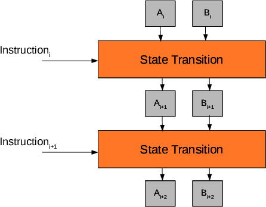
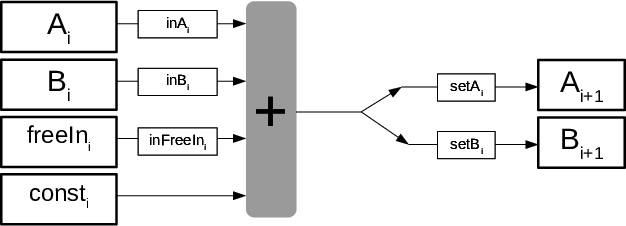
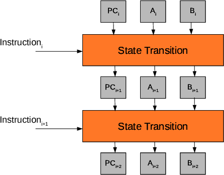

## A Simple State Machine

The following program describes a state machine with two registries $A$ and $B$ that accepts a free input: 

$$\begin{array}{|l|}
\hline
\mathbf{Instruction} \\ \hline
\mathbf{FREELOAD}~~A \\ \hline
\mathbf{MOV}~~ B~3 \\ \hline
\mathbf{ADD}~~ A~B \\ \hline
\mathbf{STOP} \\ \hline
\end{array}$$

The execution trace on input $7$ is the following:

$$\begin{array}{|l|c|c|c|c|c|}
\hline
\mathbf{Instruction} & \mathbf{freeIn} & \mathbf{A} & \mathbf{A^{+1}} & \mathbf{B} & \mathbf{B^{+1}} \\ \hline
\mathbf{FREELOAD}~~A & 7 & 0 & 7 & 0 & 0 \\ \hline
\mathbf{MOV}~~B~3 & 0 & 7 & 7 & 0 & 3 \\ \hline
\mathbf{ADD}~~A~B & 0 & 7 & 10 & 3 & 3 \\ \hline
\mathbf{STOP} & 0 & 10 & 0 & 3 & 0 \\ \hline
\end{array}$$

Notice that the **STOP** instruction resets the states' values and "glues" the last instruction with the first one, achieving a cycle.

We add auxiliary states and selectors to express the relations between the registries $A$ and $B$:

a)  $\mathbf{inX_i} \in \{0,1\}$: Selector to include or not $X_i$ in
    the linear combination.

b)  $\mathbf{setX_i} \in \{0,1\}$: Selector to move or not the result of
    the linear combination into $X_{i+1}$.

**freeIn** contains the free inputs of the instructions and **const** contains the fixed inputs of the instructions.

The relations between the states of the registries can be expressed as: 

$$\begin{aligned}
&\mathsf{A_{i+1}} = \mathsf{A_i} + \mathsf{setA_i} \cdot (\mathsf{inA_i} \cdot \mathsf{A_i} + \mathsf{inB_i} \cdot \mathsf{B_i} + \mathsf{inFreeIn}_i \cdot \mathsf{freeIn_i} + \mathsf{const_i} - \mathsf{A_i}), \\
&\mathsf{B_{i+1}} = \mathsf{B_i} + \mathsf{setB_i} \cdot (\mathsf{inA_i} \cdot \mathsf{A_i} + \mathsf{inB_i} \cdot \mathsf{B_i} +   \mathsf{inFreeIn}_i \cdot \mathsf{freeIn_i} + \mathsf{const_i} - \mathsf{B_i}).
\end{aligned}$$

$$\scriptsize
\begin{array}{|l|}
\hline
\mathbf{Instruction} \\ \hline
\mathbf{FREELOAD}~~A \\ \hline
\mathbf{MOV}~~B~3 \\ \hline
\mathbf{ADD}~~A~B \\ \hline
\mathbf{STOP} \\ \hline
\end{array}
\hspace{0.1cm}
\begin{array}{|c|c|c|c|c|c|c|c|}
\hline
\textbf{freeIn} & \textbf{const} & \textbf{setB} & \textbf{setA} & \textbf{inFreeIn} & \textbf{inB} & \textbf{inA} \\ \hline
7 & 0 & 0 & 1 & 1 & 0 & 0 \\ \hline
0 & 3 & 1 & 0 & 0 & 0 & 0 \\ \hline
0 & 0 & 0 & 1 & 0 & 1 & 1 \\ \hline
0 & 0 & 1 & 1 & 0 & 0 & 0 \\ \hline
\end{array}
\hspace{0.1cm}
\begin{array}{|c|c|c|c|}
\hline
\mathbf{A} & \mathbf{A^{+1}} & \mathbf{B} & \mathbf{B^{+1}} \\ \hline
0 & 7 & 0 & 0\\ \hline
7 & 7 & 0 & 3\\ \hline
7 & 10 & 3 & 3\\ \hline
10 & 0 & 3 & 0\\ \hline
\end{array}$$

Let's represent the states of these registries for four steps as polynomials in $\ZZ_p[x]$ evaluated on the subgroup $H = \{\omega, \omega^2, \omega^3, \omega^4 = 1\}$:

$$\begin{aligned}
&\mathsf{A(x\omega)} = \mathsf{A(x)} + \mathsf{setA(x)} \cdot (\mathsf{inA(x)} \cdot \mathsf{A(x)} + \mathsf{inB(x)} \cdot \mathsf{B(x)} + \mathsf{inFreeIn}(x) \cdot \mathsf{freeIn(x)} + \mathsf{const(x)} - \mathsf{A(x)}), \\
&\mathsf{B(x\omega)} = \mathsf{B(x)} + \mathsf{setB(x)} \cdot (\mathsf{inA(x)} \cdot \mathsf{A(x)} + \mathsf{inB(x)} \cdot \mathsf{B(x)} + \mathsf{inFreeIn}(x) \cdot \mathsf{freeIn(x)} + \mathsf{const(x)} - B(x)).
\end{aligned}$$

The "program" is described by the public polynomials **inA(x)**, **inB(x)**, **setA(x)**, **setB(x)**, **inFreeIn(x)** and **cons(x)**.

The polynomial **freeIn(x)** can be public or committed and by changing this polynomial, we can proof different executions for different initial conditions for the same "program".

## Programs with Conditional Jumps

The instruction `JMPIZ` jumps to a position in the program if the preceding operation is zero.

In the next program, `JMPIZ` will jump to position $4$ if $\mathbf{ADD}~~A~B$ is $0$: 

$$\begin{array}{|c|l|}
\hline
\textbf{Position} & \mathbf{Instruction} \\ \hline
0 & \mathbf{FREELOAD}~~A \\ \hline
1 & \mathbf{MOV}~~B~-3 \\ \hline
2 & \mathbf{ADD}~~A~B,~\mathbf{JMPIZ}~~4 \\ \hline
3 & \mathbf{ADD}~~A~B \\ \hline
4 & \mathbf{STOP} \\ \hline
\end{array}
\hspace{0.1cm}$$

In programs with conditional jumps, things get more tricky because the length of the execution trace might vary depending on the free input.

As it can be seen next, with conditional jumps, the length of the execution trace is **not constant** (it depends on the free input):

$$\scriptsize
\begin{array}{|l|c|c|c|c|c|}
\hline
\mathbf{Instruction} & \mathbf{freeIn} & \mathbf{A} & \mathbf{A^{+1}} & \mathbf{B} & \mathbf{B^{+1}} \\ \hline
\mathbf{FREELOAD}~~A & 7 & 0 & 7 & 0 & 0 \\ \hline
\mathbf{MOV}~~B~-3 & 0 & 7 & 7 & 0 & -3 \\ \hline
\mathbf{ADD}~~A~B,~\mathbf{JMPIZ}~~4 & 0 & 7 & 4 & -3 & -3 \\ \hline
\mathbf{ADD}~~A~B & 0 & 4 & 1 & -3 & -3 \\ \hline
\mathbf{STOP} & 0 & 1 & 0 & -3 & 0 \\ \hline
\end{array}$$

$$\scriptsize
\begin{array}{|l|c|c|c|c|c|}
\hline
\mathbf{Instruction} & \mathbf{freeIn} & \mathbf{A} & \mathbf{A^{+1}} & \mathbf{B} & \mathbf{B^{+1}} \\ \hline
\mathbf{FREELOAD}~~A & 3 & 0 & 3 & 0 & 0 \\ \hline
\mathbf{MOV}~~B~-3 & 0 & 3 & 3 & 0 & -3 \\ \hline
\mathbf{ADD}~~A~B,~\mathbf{JMPIZ}~~4 & 0 & 3 & 0 & -3 & -3 \\ \hline
\mathbf{STOP} & 0 & 0 & 0 & -3 & 0 \\ \hline
\end{array}$$

### Managing Conditional Jumps

To manage jumps, we need to add the **Program Counter (PC)**. The $\mathsf{PC}$ is a special registry that contains the position of the instruction in the program being executed.

We add to our table the selector $\textsf{JMPIZ}_i \in \{0,1\}$ that, whenever the condition passed to **JMPIZ** is is zero, jumps to position $\textsf{addr}_i$:

$$\tiny
\begin{array}{|l|}
\hline
\mathbf{Instruction} \\ \hline
\mathbf{FREELOAD}~~A \\ \hline
\mathbf{MOV}~~B~-3 \\ \hline
\mathbf{ADD}~~A~B,~\mathbf{JMPIZ}~~4 \\ \hline
\mathbf{ADD}~~A~B \\ \hline
\mathbf{STOP} \\ \hline
\end{array}
\hspace{0.1cm}
\begin{array}{|c|c|c|c|c|c|c|c|c|}
\hline
\textbf{freeIn} & \textbf{const} & \textbf{addr} & \textbf{JMPIZ} & \textbf{setB} & \textbf{setA} & \textbf{inFreeIn} &  \textbf{inB} & \textbf{inA} \\ \hline
7 & 0 & 0 & 0 & 0 & 1 & 1 & 0 & 0 \\ \hline
0 & -3 & 0 & 0 & 1 & 0 & 0 & 1 & 0 \\ \hline
0 & 0 & 4 & 1 & 0 & 1 & 0 & 1 & 1 \\ \hline
0 & 0 & 0 & 0 & 0 & 1 & 0 & 1 & 1 \\ \hline
0 & 0 & 0 & 1 & 1 & 1 & 0 & 0 & 0 \\ \hline
\end{array}
\hspace{0.1cm}
\begin{array}{|c|c|c|c|c|c|}
\hline
\mathbf{PC} & \mathbf{PC^{+1}} & \mathbf{A} & \mathbf{A^{+1}} & \mathbf{B} & \mathbf{B^{+1}} \\ \hline
0 & 1 & 0 & 7 & 0 & 0\\ \hline
1 & 2 & 7 & 7 & 0 & -3\\ \hline
2 & 3 & 7 & 4 & -3 & -3\\ \hline
3 & 4 & 4 & 1 & -3 & -3\\ \hline
4 & 0 & 1 & 0 & -3 & 0\\ \hline
\end{array}$$ 

$$\tiny
\begin{array}{|l|}
\hline
\mathbf{Instruction} \\ \hline
\mathbf{FREELOAD}~~A \\ \hline
\mathbf{MOV}~~B~-3 \\ \hline
\mathbf{ADD}~~A~B,~\mathbf{JMPIZ}~~4 \\ \hline
\mathbf{STOP} \\ \hline
\end{array}
\hspace{0.1cm}
\begin{array}{|c|c|c|c|c|c|c|c|c|c|}
\hline
\textbf{freeIn} & \textbf{const} & \textbf{addr} & \textbf{JMPIZ} & \textbf{setB} & \textbf{setA} & \textbf{inFreeIn} &  \textbf{inB} & \textbf{inA} \\ \hline
3 & 0 & 0 & 0 & 0 & 1 & 1 & 0 & 0 \\ \hline
0 & -3 & 0 & 0 & 1 & 0 & 0 & 1 & 0 \\ \hline
0 & 0 & 4 & 1 & 0 & 1 & 0 & 1 & 1 \\ \hline
0 & 0 & 0 & 1 & 1 & 1 & 0 & 0 & 0 \\ \hline
\end{array}
\hspace{0.1cm}
\begin{array}{|c|c|c|c|c|c|}
\hline
\mathbf{PC} & \mathbf{PC^{+1}} & \mathbf{A} & \mathbf{A^{+1}} & \mathbf{B} & \mathbf{B^{+1}} \\ \hline
0 & 1 & 0 & 3 & 0 & 0\\ \hline
1 & 2 & 3 & 3 & 0 & -3\\ \hline
2 & 4 & 3 & 0 & -3 & -3\\ \hline
4 & 0 & 0 & 0 & -3 & 0\\ \hline
\end{array}$$

The **PC** turns to be an important registry when **JUMP**s and **JUMPIZ**s are included in our set of possible instructions. This is because **JUMP**s and **JUMPIZ**s (possibly) modify the position (i.e., the instruction) that we are pointing to in the program.

For this reason, we have to find the set of constraints that perfectly describe the behavior of the **PC** in **any** execution.

This set of constraints turns out to be: 

$$\begin{aligned}
&\mathsf{op}_i := \mathsf{inA_i} \cdot \mathsf{A_i} + \mathsf{inB_i} \cdot \mathsf{B_i} + \mathsf{inFreeIn}_i \cdot \mathsf{freeIn_i} + \mathsf{const_i}, \\
&\mathsf{PC}_{i+1} = \mathsf{PC}_i + 1 + \mathsf{JMPIZ}_i \cdot (1 - \mathsf{op}_i \cdot \mathsf{op}_i^{-1}) \cdot (\mathsf{addr}_i  - \mathsf{PC}_i - 1),\\
&(1 - \mathsf{op}_i \cdot \mathsf{op}_i^{-1}) \cdot \mathsf{op}_i = 0.\end{aligned}$$

Let's see the correctness:

1.  First, we use $\textsf{op}_i$ as a shorthand for the linear combination to simplify the forthcoming constraints.

2.  Now, notice that a number $a$ in the field $\mathbb{Z}_p$ has an inverse if and only if $a \neq 0$.

3.  Using the previous fact, the **JMPIZ** instruction will jump to the passed position if the condition passed to it is zero. For the shake of generality, this condition is parameterized by the linear combination $\textsf{op}_i$. Hence, the **JMPIZ** instruction will jump to the passed position whenever $\textsf{op}_i$ is zero.

4.  Combining the previous, we obtain the constraint:

    $$\mathsf{PC}_{i+1} = \mathsf{PC}_i + 1 + \mathsf{JMPIZ}_i \cdot (1 - \mathsf{op}_i \cdot \mathsf{op}_i^{-1}) \cdot (\mathsf{addr}_i  - \mathsf{PC}_i - 1)$$

    says that if $\mathsf{op}_i \neq 0$, then $(1 - \mathsf{op}_i \cdot \mathsf{op}_i^{-1}) = 0$ and hence $\mathsf{PC}_{i+1} = \mathsf{PC}_{i} + 1$; while if $\mathsf{op}_i = 0$, then $(1 - \mathsf{op}_i \cdot \mathsf{op}_i^{-1}) = 1$ (it does not matter what $\mathsf{op}_i^{-1}$ is in this case) and hence $\mathsf{PC}_{i+1} = \mathsf{PC}_{i} + 1 + \mathsf{addr}_i  - \mathsf{PC}_i - 1 = \mathsf{addr}_i$.

5.  The last constraint
        $(1 - \mathsf{op}_i \cdot \mathsf{op}_i^{-1}) \cdot \mathsf{op}_i = 0$
        ensure the correctness of the relation between $\mathsf{op}_i$
        and $\mathsf{op}_i^{-1}$; otherwise one could set
        $\mathsf{op}_i^{-1} = 0$.

### Proving the Execution of the "Correct Program"

Up to now, we can prove that each instruction is correctly executed, but: **How do we prove that we are executing the correct set of instructions,that is to say, that we are executing the "correct program"?**

The solution seems obvious: Check that every executed instruction is some instruction in the program.

But how do we do this in a succinct manner?

To do so, we have to provide **a codification for each instruction** and then we will check that the codification of the execution's instructions is included in the codification of the program's instructions.

Consider that, for our constants, we want to use signed integers of 4 bits, as shown: 

$$\begin{array}{|c|c|c|c|c|c|c|c|c|c|c|c|c|}
\hline
-8 & -7 & -6 & ... & -2 & -1 & 0 & 1 & 2 & ... & 6 & 7 & 8 \\ \hline
1000 & 1001 & 0110 & ... & 1110 & 1111 & 0000 & 0001 & 0010 & ... & 0110 & 0111 & 1000 \\ \hline
\end{array}$$

Notice that with this arithmetic $8=-8$, which is a weird case that we discard, using only values from -7 to 7.

Then, we encode these values in elements of the field $\mathbb{Z}_p$:

$$\begin{array}{|c|c|c|c|c|c|c|c|c|c|c|}
\hline
-7 & -6 & ... & -2 & -1 & 0 & 1 & 2 & ...& 6 & 7 \\ \hline
p-7 & p-6 & ... & p-2 & p-1 & 0 & 1 & 2 & ...& 6 & 7  \\ \hline
\end{array}$$

So, we have to enforce that $const(x) \in \{p-7, p-6, ..., p-2, p-1, 0,1,2, ..., 6, 7\}$.

We enforce the previous condition with the following inclusion: 

$$const(x) + 7 \in \{0,1,2,...,14\}$$

Let's now explain how to encode every **distinct** instruction to be executed by the program: 

$$\scriptsize
\begin{array}{|c|l|}
\hline
\mathbf{Instruction} \\ \hline
\mathbf{FREELOAD}~~A \\ \hline
\mathbf{MOV}~~B~-3 \\ \hline
\mathbf{ADD}~~A~B,~\mathbf{JMPIZ}~~4 \\ \hline
\mathbf{ADD}~~A~B \\ \hline
\mathbf{STOP} \\ \hline
\end{array}
\hspace{0.1cm}
\begin{array}{|c|c|c|c|c|c|c|c|c|c|c|}
\hline
\textbf{const+7} & \textbf{addr} & \textbf{JMPIZ} & \textbf{setB} & \textbf{setA} & \textbf{inFreeIn} & \textbf{inB} & \textbf{inA} & \textbf{instruction code} \\ \hline
0 & 0 & 0 & 0 & 1 & 1 & 0 & 0 & 0000.0000.001100 \\ \hline
3 & 0 & 0 & 1 & 0 & 0 & 0 & 0 & 0011.0000.010000 \\ \hline
0 & 4 & 1 & 0 & 0 & 0 & 0 & 1 & 0000.0100.100001 \\ \hline
0 & 0 & 0 & 0 & 1 & 0 & 1 & 0 & 0000.0000.001010 \\ \hline
0 & 0 & 1 & 1 & 1 & 0 & 0 & 0 & 0000.0000.111000 \\ \hline
\end{array}$$

$$\textsf{instruction}_i := 2^{13}\cdot\textsf{const}_i + 2^9\cdot \textsf{addr}_i + 2^5\cdot \textsf{JMPIZ}_i + 2^4 \cdot \textsf{setB}_i + 2^3 \cdot \textsf{setA}_i + 2^2 \cdot \textsf{inFreeIn}_i + 2 \cdot \textsf{inB}_i + \textsf{inA}_i.$$

As a polynomial identity: 

$$\begin{aligned}
\textsf{instruction}(x) := &~2^{13}\cdot\textsf{const}(x) + 2^9\cdot \textsf{addr}(x) + 2^5\cdot \textsf{setJMPC}(x) + 2^4 \cdot \textsf{setB}(x) + \\ 
&2^3 \cdot \textsf{setA}(x) + 2^2 \cdot \textsf{inFreeIn}(x) + 2 \cdot \textsf{inB}(x) + \textsf{inA}(x).
\end{aligned}$$

Note that additionally, we will need to check that the selectors are binary and that **const** and **addr** are composed of $4$ bits.

The ROM of a Program

Now, to prove the program, every instruction will be uniquely identified by its code and position in the program.

We define the **ROM** of the program as the sum between every instruction and the position in which it is defined:

$$\textsf{ROM}_i := 2^{17}  \cdot \textsf{position}_i + \textsf{instruction}_i \quad \Longrightarrow \quad \textsf{ROM}(x) := 2^{17}  \cdot \textsf{position}(x) + \textsf{instruction}(x).$$

The resulting ROM of our program is the following:

$$\begin{array}{|c|c|c|}
\hline
\textbf{Position} & \multicolumn{2}{|c|}{\mathbf{Instruction}} \\ \hline
0 & \mathbf{FREELOAD} & A \\ \hline
1 & \mathbf{MOV} & B, 3 \\ \hline
2 & \mathbf{JUMPC}~(A=0) & 4 \\ \hline
3 & \mathbf{ADD} & A, B \\ \hline
4 & \mathbf{STOP} & \emptyset \\ \hline
\end{array}
\hspace{0.1cm}
\begin{array}{|c|}
\hline
\textbf{ROM} \\ \hline
0000.0000.0000.001100 \\ \hline
0001.0011.0000.010000 \\ \hline
0010.0000.0100.100001 \\ \hline
0011.0000.0000.001010 \\ \hline
0100.0000.0000.111000 \\ \hline
\end{array}$$

We can do a similar procedure with the execution traces. Here, however, we consider the program counter instead in place of the execution step:

$$\scriptsize
\begin{array}{|c|c|c|c|c|c|}
\hline
\mathbf{PC} \\ \hline
0 \\ \hline
1 \\ \hline
2 \\ \hline
3 \\ \hline
4 \\ \hline
\end{array}
\hspace{0.1cm}
\begin{array}{|c|c|c|}
\hline
\multicolumn{2}{|c|}{\mathbf{Instruction}} \\ \hline
\mathbf{FREELOAD} & A \\ \hline
\mathbf{MOV} & B, 3 \\ \hline
\mathbf{JUMPC}~(A=0) & 4 \\ \hline
\mathbf{ADD} & A, B \\ \hline
\mathbf{STOP} & \emptyset \\ \hline
\end{array}
\hspace{0.1cm}
\begin{array}{|c|c|c|c|c|c|c|c|c|}
\hline
\textbf{const} & \textbf{addr} & \textbf{setJMPC} & \textbf{setB} & \textbf{setA} & \textbf{inFreeIn} &  \textbf{inB} & \textbf{inA} \\ \hline
0 & 0 & 0 & 0 & 1 & 1 & 0 & 0 \\ \hline
3 & 0 & 0 & 1 & 0 & 0 & 0 & 0 \\ \hline
0 & 4 & 1 & 0 & 0 & 0 & 0 & 1 \\ \hline
0 & 0 & 0 & 0 & 1 & 0 & 1 & 0 \\ \hline
0 & 0 & 1 & 1 & 1 & 0 & 0 & 0 \\ \hline
\end{array}
\hspace{0.1cm}
\begin{array}{|c|c|c|c|c|c|}
\hline
\mathbf{insTrace} \\ \hline
0000.0000.0000.001100 \\ \hline
0001.0011.0000.010000 \\ \hline
0010.0000.0100.100001 \\ \hline
0011.0000.0000.001010 \\ \hline
0100.0000.0000.111000 \\ \hline
\end{array}$$

$$\scriptsize
\begin{array}{|c|c|c|c|c|c|}
\hline
\mathbf{PC} \\ \hline
0 \\ \hline
1 \\ \hline
2 \\ \hline
4 \\ \hline
\end{array}
\hspace{0.1cm}
\begin{array}{|c|c|c|}
\hline
\multicolumn{2}{|c|}{\mathbf{Instruction}} \\ \hline
\mathbf{FREELOAD} & A \\ \hline
\mathbf{MOV} & B, 3 \\ \hline
\mathbf{JUMPC}~(A=0) & 4 \\ \hline
\mathbf{STOP} & \emptyset \\ \hline
\end{array}
\hspace{0.1cm}
\begin{array}{|c|c|c|c|c|c|c|c|c|c|}
\hline
\textbf{const} & \textbf{addr} & \textbf{setJMPC} & \textbf{setB} & \textbf{setA} & \textbf{inFreeIn} &  \textbf{inB} & \textbf{inA} \\ \hline
0 & 0 & 0 & 0 & 1 & 1 & 0 & 0 \\ \hline
3 & 0 & 0 & 1 & 0 & 0 & 0 & 0 \\ \hline
0 & 4 & 1 & 0 & 0 & 0 & 0 & 1 \\ \hline
0 & 0 & 1 & 1 & 1 & 0 & 0 & 0 \\ \hline
\end{array}
\hspace{0.1cm}
\begin{array}{|c|c|c|c|c|c|}
\hline
\mathbf{insTrace} \\ \hline
0000.0000.0000.001100 \\ \hline
0001.0011.0000.010000 \\ \hline
0010.0000.0100.100001 \\ \hline
0100.0000.0000.111000 \\ \hline
\end{array}$$

Recall that our main question was: **How do we actually check correctness in an efficient manner?**

We can achieve it with the [Plookup](https://eprint.iacr.org/2020/315.pdf) protocol. So, to check that the correct program is being executed, we simply have to use Plookup to determine if:

$$\mathbf{insTrace(x)} \subset \mathbf{ROM(x)}$$

In words, the trace being executed is an execution of the actual program if the instruction trace is contained in the ROM of the program.

### Identities to Prove an Execution Trace 

We have seen that the following set of relations (almost) define our program: 

$$\begin{aligned}
&\mathsf{op}(x) = \mathsf{inA}(x) \cdot \mathsf{A}(x) + \mathsf{inB}(x) \cdot \mathsf{B}(x) + \mathsf{inFreeIn}(x) \cdot \mathsf{freeIn}(x) + \mathsf{const}(x), \\
&\mathsf{A(x\omega)} = \mathsf{A(x)} + \mathsf{setA(x)} \cdot (\mathsf{op}(x) - \mathsf{A(x)}), \\
&\mathsf{B(x\omega)} = \mathsf{B(x)} + \mathsf{setB(x)} \cdot (\mathsf{op}(x) - B(x)), \\
&(1 - \mathsf{op}(x) \cdot \mathsf{op}(x)^{-1}) \cdot \mathsf{op}(x) = 0,\\
&\mathsf{PC}(x\omega) = \mathsf{PC}(x) + 1 + \mathsf{setJMPC}(x) \cdot (1 - \mathsf{op}(x) \cdot \mathsf{op}(x)^{-1}) \cdot (\mathsf{addr}(x)  - \mathsf{PC}(x) - 1), \\
&\textsf{instruction}(x) = 2^{13}\cdot\textsf{const}(x) + 2^9\cdot \textsf{addr}(x) + 2^5\cdot \textsf{setJMPC}(x) + 2^4 \cdot \textsf{setB}(x) + \\ 
&\qquad \qquad \qquad \quad~~ 2^3 \cdot \textsf{setA}(x) + 2^2 \cdot \textsf{inFreeIn}(x) + 2 \cdot \textsf{inB}(x) + \textsf{inA}(x),\\
&\textsf{ROM}(x) = 2^{17}  \cdot \textsf{position}(x) + \textsf{instruction}(x), \\
&\textsf{insTrace}(x) = 2^{17}  \cdot \textsf{PC}(x) + \textsf{instruction}(x).
\end{aligned}$$

Moreover, we should add the Plookup check $\textbf{insTrace} \subset \textbf{ROM}$.

Finally, it should be checked that the whole set of selectors are, in fact, binary: 

$$\begin{aligned}
&\mathsf{inA(x)} \times (\mathsf{setA(x)} - 1) = 0, \quad \mathsf{setA(x)} \times (\mathsf{setA(x)} - 1) = 0, \quad\\
&\mathsf{inB(x)} \times (\mathsf{setB(x)}- 1) = 0, \quad \mathsf{setB(x)} \times (\mathsf{setB(x)} - 1) = 0, \quad\\
&\mathsf{inFreeIn(x)} \times (\mathsf{inFreeIn(x)} - 1) = 0, \quad \mathsf{setJMPC(x)} \times (\mathsf{setJMPC(x)} - 1) = 0.
\end{aligned}$$

In our encoding example, we also need to check that $\mathsf{const}(x), \mathsf{addr}(x), \mathsf{position}(x), \mathsf{PC}(x)$ are composed of $4$ bits.
