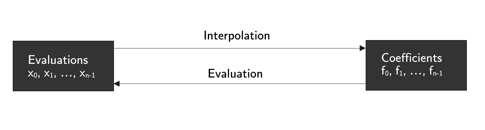

# Mathematical Tools

## Univariate Polynomial Rings

Given a group $G$ we will denote by $G[X]$ to be its univariate polynomial ring in the variable $X$. Its elements are finite linear $G$-linear combinations over the set of powers of $X$, i.e. $\{1, X, X^2, X^3, \dots, X^{n-1}, X^n, X^{n+1}, \dots \}$:

$$
f(X) = f_0 + f_1X + f_2X^2 + \dots + f_{n-1} X^{n-1} \in G[X]
$$

with $f_i \in G$. As usual in the cryptographic setup, we will work over a finite field $G = \mathbb{F}$ of order $q = p^k$, where $p$ is a prime.

Univariate polynomials are specially useful in cryptography (particularly in proof systems) because they reduce claims about large vectors to claims about the values of their corresponding polynomials in a small selection of sufficient points:

$$
\begin{align}
&a_0 \cdot b_0 = c_0 \\
&a_1 \cdot b_1 = c_1 \\
&a_2 \cdot b_2 = c_2 
\end{align}
$$

can be reduced to

$$
a(x) = b(X) + c(X)
$$

where $a(x_i) = a_i, b(x_i) = b_i$ and $c(x_i) = c_i$ for some $x_0, x_1$ and $x_2$ in $\mathbb{F}$. 

In this direction, the previous observation give us two ways of representing polynomials of degree $n-1$: 

- **Via coefficients**: That is, specifying $n$ coefficients $\{f_0, f_1, f_2, \dots, f_{n-1} \} \subset \mathbb{F}$ as before.

- **Via evaluations**: Providing the necessary number of evaluations of a specific polynomial at certain evaluation points completely identifies it. In particular, to identify a degree $n-1$ polynomial we need $n$ evaluations (as well as we also need $n$ coefficients).

<b> Figure 1: Evaluations-Coefficients Symmetry </b>

The process of getting evaluations from coefficients is called **evaluation**. The reverse process, that is, the process of finding a polynomial given the needed evaluations, is called **interpolation**. The most basic way of interpolate a set of values is called **Lagrange's Interpolation**. However, the time complexity to interpolate $n$ values is $\mathcal{O}(n^2)$, which is not, by far, the best efficiency we can get. We can get a better approach: **the Fourier Transform**. However, we will proceed the other way around: we will start describing evaluations. 

## Polynomial Evaluations

There are a bunch of ways of expressing the evaluation of a polynomial 

$$
f = f_0 + f_1X + \dots + f_{n-1}X^{n-1}
$$ 

of degree $n-1$ at $n$ given points $x_0, x_1, \dots, x_{n-1}$. A very compact way of expressing it is via a matrix multiplication:

$$
\begin{pmatrix}
f(x_0) \\
f(x_1) \\
\vdots \\
f(x_{n-1})
\end{pmatrix}
= 
\begin{pmatrix}
1 &x_0 &x_0^2 &x_0^3 &\cdots &x_0^{n-1} \\
1 &x_1 &x_1^2 &x_1^3 &\cdots &x_1^{n-1} \\
\vdots &\ddots &\ddots &\ddots &\cdots &\vdots\\
1 &x_{n-1} &x_{n-1}^2 &x_{n-1}^3 &\cdots &x_{n-1}^{n-1} \\
\end{pmatrix}
\begin{pmatrix}
f_0 \\
f_1 \\
\vdots \\
f_{n-1}
\end{pmatrix}
$$

Observe that, in fact, the evaluation at $n$ points is a linear map $\mathbb{F}^n \to \mathbb{F}^n$ whose matrix in the basis $(1, X, \dots, X^{n-1})$ is the previous square matrix. Therefore, evaluating at $n$ points have a $\mathcal{O}(n^2)$ complexity. The idea to reduce this complexity is to choose specific points $x_0, x_1 \dots, x_{n-1}$ having special properties. 

## Roots of Unity and Fast Fourier Transform

We say that a element $\omega \in \mathbb{F}$ is a **primitive $n$-th root of unity** if $\omega^n = 1$ but for no $m$ such that $0 < m < n$ we have $\omega^m = 1$. 

The set of powers of a primitive $n$-th root of unity $\omega$ form a cyclic subgroup of $\mathbb{F}^*$ with the following operation table:

$$
\begin{array}{|c|c|c|c|c|c|}
\hline
                &1              &\omega     &\omega^2   &\dots  &\omega^{n-1}   \\ \hline
1               &1              &\omega     &\omega^2   &\dots  &\omega^{n-1}   \\ \hline
\omega          &\omega         &\omega^2   &\omega^3   &\dots  &1              \\ \hline
\omega^2        &\omega^2       &\omega^3   &\omega^4   &\dots  &\omega         \\ \hline
\dots           &\dots          &\dots      &\dots      &\dots  &\dots          \\ \hline
\omega^{n-1}    &\omega^{n-1}   &1          &\omega     &\dots  &\omega^{n-2}   \\ \hline
\end{array}
$$

A **Fourier Transform (FT)** is a sequence of $n$ points constituting the evaluation of a polynomial with coefficients $\{f_0, f_1, \dots, f_n\}$ at the points $\{1, \omega,  \omega^2, \dots, \omega^{n-1} \}$ where $\omega$ is a primitive $n$-th root of unity. That is, the Fourier Transform can be thought of as the left hand side of the equation below:

$$
\begin{pmatrix}
f(1) \\
f(\omega) \\
\vdots \\
f(\omega^{n-1})
\end{pmatrix}
= 
\begin{pmatrix}
1 &1 &1 &1 &\cdots &1 \\
1 &\omega &\omega^2 &\omega^3 &\cdots &\omega^{n-1} \\
\vdots &\ddots &\ddots &\ddots &\cdots &\vdots\\
1 &\omega^{n-1} &\omega^{2(n-1)} &\omega^{3(n-1)} &\cdots &\omega^{(n-1)^2} \\
\end{pmatrix}
\begin{pmatrix}
f_0 \\
f_1 \\
\vdots \\
f_{n-1}
\end{pmatrix}
$$

If $n$ is even,  in order to accomplish this matrix multiplication more rapidly, we use a clever relationship pointed out by Cooley and Tukey in their [1965 paper](https://www.ams.org/journals/mcom/1965-19-090/S0025-5718-1965-0178586-1/S0025-5718-1965-0178586-1.pdf). Moreover, if **$n$ is actually a power of $2$**, we can repeat the fast matrix multiplication recursively, obtaining the **Fast Fourier Transform (FFT)** algorithm. In fact, using the **FFT** algorithm we can reduce the $\mathcal{O}(n^2)$ operations to $\mathcal{O}(n \cdot \log{n})$ operations. 

Now, we will reverse the arrow and talk about interpolation. The idea is that, if we are provided of the evaluations of a polynomial $f$ at the points $1, \omega, \dots, \omega^{n-1}$, we would like to rapidly recover the provided polynomial

$$
f = f_0 + f_1X + \dots + f_{n-1}X^{n-1}
$$ 

or equivalently, its coefficients $(f_0, f_1, \dots, f_{n-1})$. We can achieve this using linear algebra an inverting the previous transformation matrix

$$ 
\frac{1}{n}
\begin{pmatrix}
1 &1 &1 &1 &\cdots &1 \\
1 &\omega^{-1} &\omega^{-2} &\omega^{-3} &\cdots &\omega^{-(n-1)} \\
\vdots &\ddots &\ddots &\ddots &\cdots &\vdots\\
1 &\omega^{-(n-1)} &\omega^{-2(n-1)} &\omega^{-3(n-1)} &\cdots &\omega^{-(n-1)^2} \\
\end{pmatrix}
$$

The key fact here is that we can also use the previous **FFT** algorithm here because the matrix preserves the same form (since $\omega^{-1}$ is also a primitive root of unity). Hence, we get an interpolation complexity of $\mathcal{O}(n \cdot \log{n})$. 