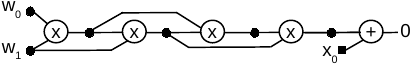
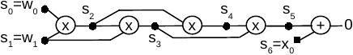
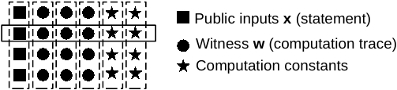
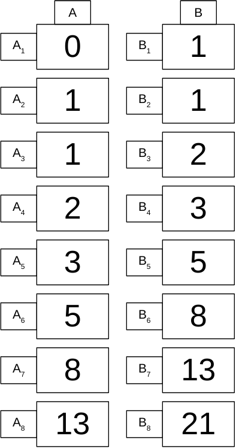
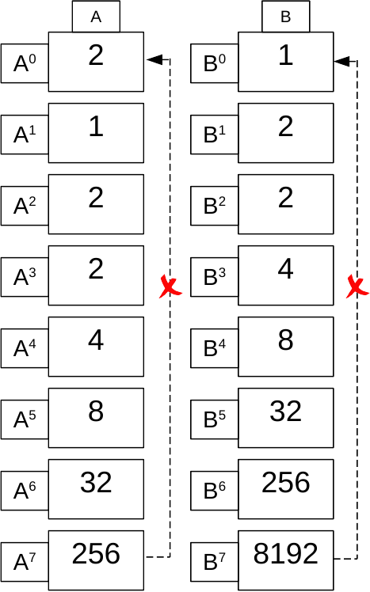
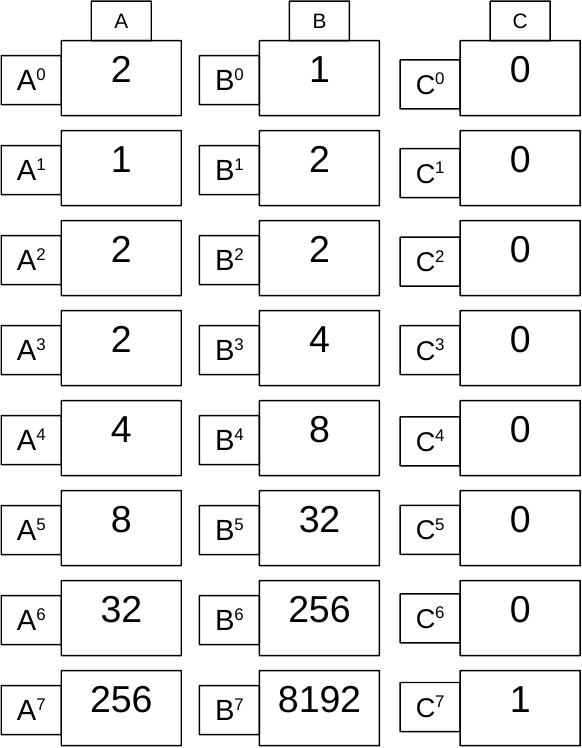
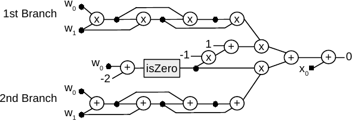

# ZK Protocols for Proving Generic Computations

As explained before, zkEVM employs advanced zero-knowledge technology to create validity proofs. Traditional ZK protocols allow us to prove the knowledge of a witness of a specific computation like a discrete logarithm. However, traditional ZK protocols only allow us to prove one kind of mathematical fact at the time and then, we need some type 
of composition method to check more generic computations. A natural question arises: 

**How can we create generic ZK protocols for arbitrary computations?** 

In order to simplify the proving specific documentation, we will propose a simple example that we will follow through all this section: the **multiplicative Fibonacci sequences**. 

Recall that a multiplicative Fibonacci sequence is a sequence $(s_0, s_1, s_2, s_3, \dots)$ which is generated by providing two initial values and then, the next term is obtained by multiplying the two previous ones:

$$
(s_0, s_1, s_0 \cdot s_1, s_0 \cdot s_1^2, s_0^2 \cdot s_1^3, s_0^3 \cdot s_1^5, s_0^5 \cdot s_1^8, s_0^8 \cdot s_1^{13}, \dots).
$$

For example, if $s_0 = 2$ and $s_1 = 1$, we get the following sequence:

$$
(2, 1, 2, 2, 4, 8, 32, 256, \dots).
$$

Observe that the arithmetic expression that defines the multiplicative Fibonacci sequence is:

$$
s_i = s_{i-1} \cdot s_{i-2}.
$$

As usual in cryptographic setups, we will work over some finite field $\mathbb{F}$. We will mainly use two fields:

- **bn128**: field used in the pairing-friendly elliptic curve bn128.  
- **Goldilocks**: prime field of order $2^{64} - 2^{32} + 1$. 

Goldilocks is the base field of the zkEVM but, as we will see later on, since bn128 is pairing-friendly, we will use bn128 to generate efficient **Groth16** proofs. 

The statement that we want to prove will be **the knowledge of a multiplicative Fibonacci sequence whose $1024$-th therm is some public number $x \in \mathbb{F}$**. To be more concrete, we will select a concrete sequence by predefining the secret values to be $s_0 = 2$ and $s_1 = 1$. In each specified field, the corresponding public values of $x$ are the following:

- Working over bn128 field

$$
\begin{align*}
x = &2^3 \cdot 3^2 \cdot 7253 \cdot 12669331 \cdot 2680611707 \cdot  \\
& \cdot 751699529692860972051992005501555059640927974845613689 \\
\end{align*}
$$

- Working over the Goldilocks field 

$$
x = 144115188042301440 = \mathtt{0xFFFFFFFF00000001}.
$$


## Arithmetization

To answer the previous question on how to create generic ZK protocols , the first step is to **arithmetize** the computation. A computation is expressed as a set of values. Some of these values are public inputs (that we will denote by $x$ fom now on), other values are private (denoted by $w$, which comes from *witness*), and some others are related to the computation being done. Each such computation imposes arithmetic relationships between these values. The process of express the necessary values and related relationships as polynomial identities is called **arithmetization of the computation**. These polynomial identities are called a **Intermediate Representation**. In our sample statement, the witness private values will be $w_0 = s_0$ and $w_1 = s_1$, and the public input will be $x = s_{1023}$. 

<center>

</center>

<div align="center"><b> Figure 1: Schema of a Computation </b></div>

In general, in modern protocols, the process of efficiently proving an arithmetization involves interpolating values into polynomials and efficiently proving related relationships between these polynomials. 

We have two computation models for arithmetizing computations:

- **Circuit computations**: Signals propagating through a network of gates.
- **Machine computations**: Transition function applied to a computation state.

For example, we can express the previous Fibonacci statement (we will depict circuits up to the $6$-th therm for sake of simplicity) using the following arithmetic circuit:

<center>

</center>

<div align="center"><b> Figure 2: Fibonacci Arithmetic Circuit </b></div>


## Circuit computations

In general, given a arithmetic circuit, there exists a procedure to express its arithmetic relations using a set of constraints having the following form:

$$
\left\{ \begin{array}{rclclcl}
(a_{00}s_0 + a_{01}s_1 + \dots + a_{0m}s_m) &\cdot& (b_{00} s_1 + b_{01} s_1 + \dots + b_{0m} s_m) &-& (c_{00} s_0 + c_{01}s_1~ + \dots + c_{0m}s_m) &=& 0 \\
(a_{10}s_0 + a_{11}s_1 + \dots + a_{1m}s_m) &\cdot& (b_{10} s_0 + b_{11} s_1 + \dots + b_{1m} s_m) &-& (c_{10} s_0 + c_{11}s_1~ + \dots + c_{1m}s_m) &=& 0 \\
\dots\\
(a_{n0}s_0 + a_{n1}s_1 + \dots + a_{nm}s_m) &\cdot& (b_{n0} s_0 + b_{n1} s_1 + \dots + b_{nm} s_m) &-& (c_{n0} s_0 + c_{n1}s_1~ + \dots + c_{nm}s_m) &=& 0 
 \end{array}
\right.
$$

This IR is called Rank 1 Constraints System (R1CS). The R1CS for the multiplicative Fibonacci Circuit is the following one:

$$
\begin{align*}
s_0 \cdot s_1 - s_2 &= 0 \\
s_1 \cdot s_2 - s_3 &= 0 \\
s_2 \cdot s_3 - s_4 &= 0 \\
s_3 \cdot s_4 - s_5 &= 0 \\
\dots \\
s_{1021} \cdot s_{1022} - s_{1023} &= 0 \\
s_{1023} + s_{1024} &= 0
\end{align*}
$$

Observe that we can simplify the last two equations

$$
\begin{align*}
s_0 \cdot s_1 - s_2 &= 0 \\
s_1 \cdot s_2 - s_3 &= 0 \\
s_2 \cdot s_3 - s_4 &= 0 \\
s_3 \cdot s_4 - s_5 &= 0 \\
\dots \\
s_{1021} \cdot s_{1022} + s_{1024} &= 0 \\
\end{align*}
$$

We end up with $1022$ constraints. Note that in R1CS, \# constraints is proportional to the number of multiplications used. In this example, to the number of multiplicative Fibonacci terms computed.

<center>

</center>

<div align="center"><b> Figure 3: Fibonacci R1CS Representation </b></div>

However, to make the job of extracting the constraints easier, there exists several compilers that can get the R1CS for a specific circuit, such as **CIRCOM**. For example, the following **CIRCOM** program

```
pragma circom 2.0.0;

template MultiplicativeFibonacci(n) {
  signal input s0;
  signal input s1;
  signal output out;
  signal im[n-2];

   for (var i=0; i<n-2; i++) {
      if (i==0) {
          im[i] <== s0 * s1;
       } else if (i==1) {
          im[i] <== s1 * im[0];
       } else {
          im[i] <== im[i-2] * im[i-1];
       }
   }

   out <== im[n-3];
}

component main = MultiplicativeFibonacci(1024);
```

can get the R1CS Intermediate Representation of the multiplicative Fibonacci sequence example. In fact, running the corresponding command 

```
$ circom mfibonacci.circom --r1cs --wasm --sym --c
```

we get the following output:

```
template instances: 1
non-linear constraints: 1022
linear constraints: 0
public inputs: 0
public outputs: 1
private inputs: 2
private outputs: 0
wires: 1025
labels: 1026
```

which actually matches with the previous by-hand derivation. An important remark is that, in **CIRCOM**, inputs are private and outputs are public by default. The reader may check the [CIRCOM](https://docs.circom.io) specific documentation. 


## R1CS Proof Generation

Having the Intermediate Representation constraint system that perfectly describes the statement we want to prove, it is time for the proof itself. However, we can pack all the $1022$ arithmetic constraints into a single polynomial constraint. The idea is that, from the R1CS constraints, we can interpolate (in some domain, typically a subgroup $\mathcal{H}$ of the multiplicative group of the field $\mathbb{F}$) the columns of $a$',s $b$'s and $c$'s to get $3$ sets of $m + 1$ polynomials:

$$
\begin{align*}
&a_0(X), \dots, a_m(X) \\
&b_0(X), \dots, b_m(X) \\
&c_0(X), \dots, c_m(X)
\end{align*}
$$

We build the corresponding **Quadratic Arithmetic Program (QAP)** with these polynomials, which is the following identity over the previously specified domain:

$$
\begin{align*}
a_0(X) s_0 + a_{1}(X) s_1 + \dots + a_{m}(X)s_m) \cdot (b_{0}(X)s_0 + b_{1}(X) s_1 + \dots + b_{m}(X) s_m) - (c_{0}(X) s_0 + c_{1}(X)s_1~ + \dots + c_{m}(X)s_m) &= 0
\end{align*}
$$

Both [Pinocchio](https://eprint.iacr.org/2013/279.pdf) and its optimized version [Groth16](https://eprint.iacr.org/2016/260.pdf) prove a special equation with linear combinations of polynomials $a_i(X)$'s,  $b_i(X)$'s, and $c_i(X)$'s with the witness and public inputs. Groth16 is the most efficient way of proving a system, the main drawback is that it is necessary to run a Trusted Setup per circuit. Both protocols are called **Succinct Non-Interactive ARgument of Knowledge (SNARK)**. 

To generate a valid proof of the multiplicative Fibonacci we will use a **CIRCOM** as before, in order to generate the R1CS constraint system and **snarkjs**, to generate the proof of the previously computed R1CS. 

We begin with the generic part of the trusted setup that is valid for all the circuits. This phase is also known as  "powers of tau".The powers of tau generates generic randomness valid for all the circuits and known as SRS (Structured Reference String). To start the powers of tau, we use the following command:

```
snarkjs powersoftau new bn128 12 pot12_0000.ptau -v
```

Then, we contribute to the ceremony:

```
snarkjs powersoftau contribute pot12_0000.ptau pot12_0001.ptau --name="First contribution" -v
```

Now, we have the contributions to the powers of tau in the file $\texttt{pot12_0001.ptau}$, we can proceed with the Phase 2 (phase 2 is circuit-specific). Execute the following command to start the generation of this phase:

```
snarkjs powersoftau prepare phase2 pot12_0001.ptau pot12_final.ptau -v
```

Next, we generate a $\texttt{.zkey}$ file that will contain the proving key ($pk$) and the verification key ($vk$) together with all phase 2 contributions. Execute the following command to start a new zkey:

```
snarkjs groth16 setup mfibonacci.r1cs pot12_final.ptau mfibonacci_0000.zkey
```

Contribute to the phase 2 of the ceremony:

```
snarkjs zkey contribute mfibonacci_0000.zkey mfibonacci_0001.zkey --name="1st Contributor Name" -v
```

Export the verification key:

```
snarkjs zkey export verificationkey mfibonacci_0001.zkey verification_key.json 
```

Now, we follow the steps of the prover by first creating the input file called $\texttt{input.json}$:

```js
{"s0":1, "s1": 2}
```
Execute the command to generate the witness binary file (in this case with WASM):

```
mfibonacci_js$ node generate_witness.js mfibonacci.wasm input.json witness.wtns
```


Once the witness is computed and the trusted setup is already executed, we can generate a zk-proof associated to the circuit and the witness:

```
snarkjs groth16 prove mfibonacci_0001.zkey witness.wtns proof.json public.json
```

This command generates a Groth16 proof and outputs two files:

- $\texttt{proof.json}$: it contains the proof.
- $\texttt{public.json}$: it contains the values of the public inputs and outputs.

To verify the proof, execute the following command:

```
snarkjs groth16 verify verification_key.json public.json proof.json
```

The command uses the files $\texttt{verification_key.json}$ we exported earlier, $\texttt{proof.json}$ and $\texttt{public.json}$ to check if the proof is valid. If the proof is valid, the command outputs an OK. A valid proof not only proves that we know a set of signals that satisfy the circuit. But also that the public inputs and outputs that we use match the ones described in the $\texttt{public.json}$ file.


## Machine computations

However, as we have mentioned before, circuits is not the only model of computation we should use to arithmetize statements. The **state machine** model uses the concepts of **state** and **clock** to provide more efficient arithmetizations of certain computations (more on this later on).

<center>

<div align="center"><b> Figure 4: State Machine Model of Computation </b></div>
</center>

A set of values of different registries form a **state**. Then, the constraints define how values of the same state or values of a state and its previous state are related. Let us use the multiplicative Fibonacci sequence to build a state machine. We are going to use two registries $A$ and $B$. Contraints used in the zk State Machines relate the values of the same step and (possibly) values of the previous step.

<center>

</center>

<div align="center"><b> Figure 5: Fibonacci State Machine </b></div>


As we can see, we have the following relations among the registers of the Fibonacci state machine:

$$
\begin{align*}
A_{0} = 2,~&~B_{0} = 1, \\
A_{i+1} &= B_i, \\
B_{i+1} &= A_i \cdot B_i.
\end{align*}
$$

Now, let us pack the state of these registries for four steps as polynomials in $\mathbb{F}[X]$ evaluated on the subgroup $H = \langle \omega \rangle = \{\omega^0, \omega^1, \omega^2, \omega^3, \omega^4, \omega^5, \omega^6, \omega^7 \}$:

$$
\begin{align*}
A(\omega^i) &= A_i \quad \Longrightarrow \quad A = [2, 1, 2, 2, 4, 8, 32, 256],\\
B(\omega^i) &= B_i \quad \Longrightarrow \quad B = [1, 2, 2, 4, 8, 32, 256, 8192].
\end{align*}
$$

The relations between the states of registries 

$$
\begin{align*}
A_{i+1} &= B_i, \\
B_{i+1} &= A_i \cdot B_i,
\end{align*}
$$

for $i \in [7]$, are translated into identities in the polynomial setting:

$$
\begin{align*}
A(x\omega) &= \bigg\lvert_H  B(X), \\
B(x\omega) &= \bigg\lvert_H  A(X) \cdot B(X).
\end{align*}
$$

So we have:

$$
\begin{align*}
A(X\omega) = \bigg\lvert_H  B(X), \quad
B(X\omega) = \bigg\lvert_H  A(X) \cdot B(X).
\end{align*}
$$

However, the previous identities do not correctly and uniquely describe our sequence because when we evaluate the identities at $X = \omega^7$:

$$
\begin{align*}
A(\omega^7 \cdot \omega) = A(\omega^0) = 2 &\neq  8192 = B(\omega^7), \\
B(\omega^7 \cdot \omega) = B(\omega^0) = 1 &\neq  256 \cdot 8192 = A(\omega^7) \cdot B(\omega^7).
\end{align*}
$$

<center>

</center>

<div align="center"><b> Figure 6: Non-cyclicity Problem </b></div>

Meaning that the state machine does not have a **cyclic** behavior. We can solve this by adding an auxiliary registry $C$ that will be activated in the last value of the execution trace:

$$
\begin{align*}
C(\omega^i) &= C_i \quad \Longrightarrow \quad C = [0, 0, 0, 0, 0, 0, 0, 1].
\end{align*}
$$

<center>

</center>

<div align="center"><b> Figure 7: Auxiliary Registry to achieve cyclicity. </b></div>

Now, we can fix the previous identities in order to add cyclic behavior:

$$
\begin{align*}
[1-C(X)]\cdot [A(X\omega) - B(X)] + C(X) [A(X\omega)-A_0] = \bigg\lvert_H & 0, \\
[1-C(X)]\cdot [B(X\omega) - (A(X) \cdot B(X))] + C(X) [B(X\omega)-B_0] = \bigg\lvert_H & 0.
\end{align*}
$$

Note that now at $X = \omega^7$ the identities are satisfied:

$$
\begin{align*}
0 \cdot [A(\omega^0) - B(\omega^7)] + [A(\omega^0)-A_0] = \bigg\lvert_H & 0, \\
0 \cdot [B(\omega^0) - (A(\omega^7) \cdot B(\omega^7))] + [B(\omega^0)-B_0] = \bigg\lvert_H & 0.
\end{align*}
$$

Recall that we want to check the correctness of the 1024th term. To achieve this, we do not enforce the inputs in our identities but the output. Then, we have the following identities, which provide the arithmetization of the multiplicative Fibonacci state machine:

$$
\begin{align*}
[1-C(X)]\cdot [A(X\omega) - B(X)]  &= \bigg\lvert_H  0, \\
[1-C(X)]\cdot [B(X\omega) - (A(X) \cdot B(X))] &= \bigg\lvert_H  0\\
A(\omega^{1023}) &= 144115188042301440
\end{align*}
$$

where we have added the **boundary constraint** $A(\omega^{1023}) = 144115188042301440$ to enforce the correctness of the output. 

As an example to create the execution trace, we can create the following JS file called $\texttt{mfibonacci.js}$:

```js
const { FGL } = require("pil-stark");  

const N = 1024;
const a=[],b=[];
a[0] = BigInt(2);
b[0] = BigInt(1);

for (let i=1; i<N; i++) {
    a[i] =b[i-1];
    b[i] = FGL.mul(a[i-1], b[i-1]);
}

console.log(a);
console.log(a[1023]);
```

To execute the code we can do it using the following commands:

```
project$ npm install pil-stark yargs chai
project$ node mfibonacci.js
```

The $\mathtt{FGL}$ class imported from $\mathtt{pil-stark}$ is actually a degree $3$ extension of the Goldilocks field but, in fact, can perform operations over the prime Goldilocks field if we are working with Big Integers, like above. We present below a piece of code that illustrates us how multiplication is done in this fields. Observe that, when both $a$ and $b$ are Big Integers, then the usual multiplication modulo $p = \mathtt{0xFFFFFFFF00000001}$ is performed. The other if branches are invoked when working in the degree $3$ extension, which will be actually used in the Recursive STARK. 

```js
module.exports = class FGL {

    constructor() {
        this.p = 0xFFFFFFFF00000001n
        // ...
    }

    mul(a, b) {
        if (typeof(a) == "bigint") {
            if (typeof(b) == "bigint") {
                return (a*b) % this.p;
            } else {
                return [(a*b[0]) % this.p,  (a*b[1]) % this.p, (a*b[2]) % this.p];
            }
        } else if (typeof(b) == "bigint") {
            return [(a[0]*b) % this.p,  (a[1]*b) % this.p, (a[2]*b) % this.p];
        } else {
            const A = (a[0] + a[1])  * (b[0] + b[1]);
            const B = (a[0] + a[2])  * (b[0] + b[2]);
            const C = (a[1] + a[2])  * (b[1] + b[2]);
            const D = a[0]*b[0];
            const E = a[1]*b[1];
            const F = a[2]*b[2];
            const G = D - E;

            return [ (C + G - F)%this.p,  (A + C - E -E - D )%this.p,(B-G)%this.p ];
        }
    }
}
```


## MSAT Proof Generation

To prove a **MSAT (Machine Satisfiability)** statement we will use the **Schwartz-Zippel Lemma** and a **Polynomial Commitment Scheme (PCS)**:

- **Schwartz-Zippel Lemma** says that if you take two polynomials of relatively low degree with regard the number of elements of the field, then, select a random element of the field and evaluate the two polynomials at this element, if they match they are the same polynomial with overwhelming probability.

- A **PCS** allows to commit to polynomials and open these polynomials in random values.

Then, the procedure to prove a state machine computation will be:

- With the **PCS** we commit the required polynomials.
- Then, the verifier selects a random point.
- Prover provides corresponding openings (evaluations) of committed polynomials.
- By **Schwartz-Zippel**, if the identity holds at the random point it holds everywhere.
- The identities might include committed polynomials and constant polynomials (publicly known polynomials that are constant for the computation).

Let us move to the Fibonacci example. At a high level, to prove the multiplicative Fibonacci statement, we will follow the following steps:

- With the PCS, the prover commits $A(X)$ and $B(X)$.
- The verifier selects a random point $z$.
- The prover provides $A(z)$, $A(\omega z)$, $B(z)$ and $B(\omega z)$.
- The verifier checks the correctness of the 3 polynomial identities that describe the mFibonacci computation is checked with the provided values.

The identities might include not only committed polynomials, but also constant polynomials, that is, public polynomials that are constant for the computation. For the multiplicative Fibonacci example, $C(x)$ is a constant polynomial, while $A(X)$ and $B(X)$ are committed.

The described protocol used for proving **MSAT** statements is called **Scalable Transparent Argument of Knowledge (STARK)**. This protocol will be fully described in its proper [STARK]() section. In fact, due to the magnitude of the zkEVM, the proving system used there is a more involved version, called Recusrive **STARK**. We will also explain the **STARK** recursion in the [STARK]() section but, at a high level, what is does is to recursively generate **SNARK** circuit proofs with **snarkjs** and **CIRCOM** for proving the previous **SNARK** until arriving the last one, which will be proved via a **STARK**. For sake of simplicity, from now on we will aim to generate only a single **STARK** proof. 

The idea of this section is to provide a complete tutorial on how to validate the multiplicative Fibonacci statement using the State Machine approach. First of all, install the needed dependencies:

```
$ node install pilcom pil-stark yargs chai
```

The **Polynomial Identity Language (PIL)** is a domain-specific language for defining the identities that define the computation carried out by a state machine. The reader can refer to the specific [PIL Language](../../zk-Tooling/PIL/Introduction.md) section in order to go deeper into this tool. However, we describe the previous identities of our Fibonacci computation with PIL:

```
// mfib.pil

constant %N = 1024;

namespace mFibonacci(%N);
   pol constant ISLAST;    // 0,0,0,0,.....,1
   pol commit a, b;
   pol ab = a*b;

   (1-ISLAST) * (a' - b) = 0;
   (1-ISLAST) * (b' - (ab)) = 0;
   ISLAST *( a- 144115188042301440) = 0; 
```

We will not fully explain PIL here, but we will comment some important facts. The primas appearing in the polynomials represent the value of the polynomial but in the next step of the State Machine. Hence, it is equivalent to evaluate at $\omega X$. Also, observe that we do not write $\mathtt{a * b}$ directly into the second constraint. This is because PIL language only accepts degree two expressions. If we write $a*b$ instead, the expression 

$$
\mathtt{(1 - ISLAST) * (b' - a*b) = b' - a*b - ISLAST * b' - ISLAST * a * b}
$$

will contain $\mathtt{ISLAST * a * b}$ as a degree $3$ "monomial" (abusing of notation). 

The .pil files are compiled via a PIL compiler, 
which is located in the following repository: [PIL Compiler](https://github.com/0xPolygonHermez/pilcom).
The compiler, produces a .json which will be interpreted by the STARK generator and, together with the execution trace (seen
as a set of polynomial evaluations) generated by the our previous $\mathtt{mfibonacci.js}$ program will generate a proof. 


To see the PIL compiler in action, it is possible to compile a .pil into
the corresponding .json file using the following commands inside the previous
repository:

```sh
$ node src/pil.js <input.pil> -o <output.pil.json>
```

*Note*: Previously, it is important to install the node modules 
```sh
$ npm install
```
and build the parsers
```sh
$ npm run build
```
Now, we can compile the PIL file corresponding to the Fibonacci State Machine:

```
pilcom/src$ node pil.js myproject/mfib.pil -o myproject/mfib.pil.json
```

```
Input Pol Commitments: 2
Q Pol Commitments: 1
Constant Pols: 1
Im Pols: 1
plookupIdentities: 0
permutationIdentities: 0
connectionIdentities: 0
polIdentities: 3
```

The output of the command provides some information about the diferent polynomials used. The JSON obtained from the compilation contains the parsed PIL description:

```js
{
 "nCommitments": 2,
 "nQ": 1,
 "nIm": 1,
 "nConstants": 1,
 "publics": [],
 "references": { 
  "mFibonacci.ISLAST": {"type": "constP","id": 0,"polDeg": 1024,"isArray": false},
  "mFibonacci.a": {"type": "cmP","id": 0,"polDeg": 1024,"isArray": false },
  "mFibonacci.b": {"type": "cmP","id": 1,"polDeg": 1024,"isArray": false },
  "mFibonacci.ab": {"type": "imP","id": 0,"polDeg": 1024,"isArray": false }
 },
 "expressions": [ ... ],
 "plookupIdentities": [],
 "permutationIdentities": [],
 "connectionIdentities": []
}
```

The JSON file specifies, under the references key, all the polynomials that are references in the .pil file. The references key-value stores, in its keys, the name and the $\texttt{namespace}$ associated to each polynomial in the form $\texttt{nameSpace.name}$. Each value describes a property associated to each polynomial such:

- **type**: specifies if a certain polynomial is commited, constant, calculated...
- **id**: unique id associated to each polynomial among the ones of its same type.
- **polDeg**: reflects the resulting polynomial degree.
- **isArray**: flag to control array-based polynomial definitions (more information in the detailed PIL description).

Among all the contents of the .json file, there is a key called expressions which is an array containing all the identities and operations among the corresponding polynomials. Moreover, there exists other keys which represent all inclusion, permutation and copy constrain arguments. Other important fields for debugging purposes are:

- **nCommitements**: which specifies the total number of commited polynomials.
- **nConstants**: which specifies the total number of constant polynomials referenced in the PIL file.

Now, our main purpose is to integrate both the PIL and the program that realizes the computation of the execution trace (that we will call **Executor**) and produce a valid proof using the [pil-stark](https://github.com/0xPolygonHermez/pil-stark) tool. First of all, we will generate a $\mathtt{pols}$ object which will contain an empty version of all the PIL-involved polynomials. At the beginning we should compile the PIL file. 

```js
// test_mfib.js

const { FGL, starkSetup, starkGen, starkVerify } = require("pil-stark")
const { newConstantPolsArray, newCommitPolsArray, compile, verifyPil } = require("pilcom");
const path = require("path")

// ...

const pil = await compile(FGL, path.join(__dirname, "mfib.pil"));
```

Now, using the information provided by the compiled pil json file, we can generate both constant and commited polynomial arrays using the following piece of code:

```js
const constPols =  newConstantPolsArray(pil);
const cmPols = newCommitPolsArray(pil);
```

Now, the idea is to create the $\mathtt{executor\_mfib.js}$ Executor, which will be in charge of taking empty polynomials and public inputs and fill them accordingly, in order to produce the correct execution trace. First of all, let us build the constant polynomials:

```js
// executor_mfib.js

module.exports.buildConstants = async function (pols) {

    const N = 1024;


    for ( let i=0; i<N; i++) {
        pols.ISLAST[i] = (i == N-1) ? 1n : 0n;
    }
}
```

Now, we should do the same procedure with the commited polynomials. In fact, this piece of code is very similar to the one presented before, but adapted to be integrated with *pil-stark*:

```js
// executor_mfib.js

const { FGL } = require("pil-stark");

// ...

module.exports.execute = async function (pols, input) {

    const N = 1024;


    pols.a[0] = BigInt(input[0]);
    pols.b[0] = BigInt(input[1]);

    for (let i=1; i<N; i++) {
        pols.a[i] =pols.b[i-1];
        pols.b[i] =FGL.mul(pols.a[i-1], pols.b[i-1]);
    }

    return pols.a[N-1];
}
```

Following our main process to generate a proof, we can build the constants and the commited polynomials using the previous code blocks

```js
// test_mfib.js

const input = require("./mfib.input.json");
const mFib = require("./executor_mfib");

// ...

await mFib.buildConstants(constPols.mFib);
const result = await mFib.execute(cmPols.mFib, input);
``` 
where the $\mathtt{input.json}$ file contains the following information 

```js
[2, 1]
```


With all this ingredients, we can verify is the statement contained in the execution trace and constrained by the PIL is correct. If so, we can proceed generating the proof, if not, we the proof can not be generated.

```js
// test_mfib.js

const res = await verifyPil(FGL, pil, cmPols , constPols);

if (res.length != 0) {
    console.log("The execution trace do not satisfy PIL restrictions. Aborting...");
    for (let i=0; i<res.length; i++) {
                console.log(res[i]);

    }
    return
}

console.log("PIL OK!")
```

At this point, we have set up all the requirements needed to generate the proof. However, we still need to specify the **STARK** structure. We will store it in a .json file like below:

```js
{
    "nBits": 10,
    "nBitsExt": 11,
    "nQueries": 8,
    "verificationHashType": "GL",
    "steps": [
        {"nBits": 11},
        {"nBits": 7},
        {"nBits": 3}
    ]
}
```

Do not worry about this configuration, it will be also explained in the [STARK]() section. The only this that we need to do now is to set up the **STARK**, generate the proof and validate it:

```js
// test_mfib.js

const starkStruct = require("./mfib.starkstruct.json")

//

const setup = await starkSetup(constPols, pil, starkStruct);
const resP = await starkGen(cmPols, constPols, setup.constTree, setup.starkInfo);
const resV = await starkVerify(resP.proof, resP.publics, setup.constRoot, setup.starkInfo);

if (resV === true) {
   console.log("The proof is VALID!");
} else {
   console.log("INVALID proof!");
}
```

At the end, we end up with the following piece of code:

```js
const { FGL, starkSetup, starkGen, starkVerify } = require("pil-stark")
const { newConstantPolsArray, newCommitPolsArray, compile, verifyPil } = require("pilcom");
const path = require("path")
const mFib = require("./executor_mfib");
const input = require("./mfib.input.json");
const starkStruct = require("./mfib.starkstruct.json")

async function generateAndVerifyStark() {

    const pil = await compile(FGL, path.join(__dirname, "mfib.pil"));
    const constPols =  newConstantPolsArray(pil);
    const cmPols = newCommitPolsArray(pil);
    await mFib.buildConstants(constPols.mFib);
    const result = await mFib.execute(cmPols.mFib, input);
    const res = await verifyPil(FGL, pil, cmPols , constPols);

    if (res.length != 0) {
        console.log("The execution trace do not satisfy PIL restrictions. Aborting...");
        for (let i=0; i<res.length; i++) {
                console.log(res[i]);
                return
        }
    }

    console.log("PIL OK!")

    const setup = await starkSetup(constPols, pil, starkStruct);
    const resP = await starkGen(cmPols, constPols, setup.constTree, setup.starkInfo);
    const resV = await starkVerify(resP.proof, resP.publics, setup.constRoot, setup.starkInfo);
    
    if (resV === true) {
       console.log("The proof is VALID!");
    } else {
       console.log("INVALID proof!");
    }
    
}

generateAndVerifyStark();
```

When running it, it should output **The proof is VALID!**


## Circuit Computations vs Machine Computations

The arithmetizaton of a Multiplicative Fibonacci series with a circuit model is roughly equivalent to doing so with a state machine model.

- In all the Intermediate Representations for circuits, the number of interpolated values is proportional to the number of Fibonacci terms computed.
- In the state machine, it is also the same.
- The number of polynomials, however, is slightly different with the different approaches.
  
In fact, fixed computations can be very efficiently checked with the circuit model. When state machines really shine is when the execution values (execution trace) of the computation has branches (Jumps):

- When using the circuit model, branches have to unrolled.
- This potentially creates very large circuits with many values (signals) not being really used.  

When using state machines, the execution trace can be tailored to the actual execution flow by jumping to the correct execution logic.

Let's show an example of circuit with branches:

<center>

</center>

<div align="center"><b> Figure 8: Fibonacci Circuit With Two Branches </b></div>

In the previous circuit, if $w_0=2$, the public value $x_0$ must match a term of the multiplicative Fibonacci series and otherwise, it matches a term of the additive Fibonacci series. The **isZero** piece in the middle is a smaller circuit which is composed of several constraints allowing to check if the input is or not zero, giving the output $1$ if the input is zero and $0$ otherwise. We will specify more on this later on. 


If we use **CIRCOM** to build the previous circuit, the compiler will create an efficient program to compute the witness (called "the witness calculator"). However, the witness calculator is going to compute all the signals of the 
circuit. And observe that always, the signals of one of the branches are not going 
to be used (they will be multiplied by 0). When having branches, the state machine model can deal with them in a much more efficient way. In the case of state machines, the equivalent of the witness calculator is a program that computes the execution trace and we call this program the **Executor**, as before. An executor can be "sophisticated" and read instructions to create the execution 
trace. In our case, the instructions for the executor to build the execution trace are written in an special assembly language called **zkAssembly (zkASM)**. In our example, the executor will read assembly code that will determine if it has to compute the values of a multiplicative Fibonacci series or the values of an additive one. The PIL also needs to provide the proper identities to enforce the correct processing of the Jump. As following steps, we are going to see all these components by designing a simple state machine.


In the zkEVM, the task of creating the execution trace is performed by a component called the **zkExecutor**. 
The zkExecutor is part of the **zkProver**. The zkExecutor takes as inputs the transactions of a batch, a ChainID, the root 
of a Merkle tree representing the previous state of the zkEVM in that chain and
the root of the new state after executing the transactions. 
Additionally, the zkExecutor gets values 
of the current state of the zkEVM to build the proof.

<center>

</center>

<div align="center"><b> Figure 9: Big picture of the zkProver </b></div>

The zkExecutor is in fact an interpreter of the zkASM language. The zkASM language is used to build a program called zkROM that 
when executed by the zkExecutor provides a suitable execution trace. The zkROM
is produced from the zkASM language by using the zkASM compiler, which is located in
the following repository:
[zkASM Compiler](https://github.com/0xPolygonHermez/zkasmcom). 
In the zkROM program (located in the following repository: 
[zkROM](https://github.com/0xPolygonHermez/zkevm-rom)),
each EVM opcode is implemented with a set of zkASM instructions. 
Each instruction utilizes a row of the execution trace matrix, 
also known as a "step" of the zkEVM. 

*Note*: A complete description of the zkASM language can be found in the 

To see the zkASM compiler in action, it is possible to compile a .zkasm into
the corresponding .json file using the following commands inside the previous
repository:

```sh
$ node src/zkasm.js <input.zkasm> -o <output.json>
```

*Note*: Previously, it is important to install the node modules 
```sh
$ npm install
```
and build the parsers
```sh
$ npm run build
```

The .json file contains a field `program` which is an array of maps, 
each element representing a line of the .zkasm file. Among many fields, 
every element contain 

- `fileName`: Absolute path of the file containing the corresponding assembly row.
- `lineStr`: String representing the complete line of the corresponding .zkasm file.
- `line`: A line identifier. 
- Moreover, the corresponding setters, selectors, constants and instructions will be assigned accordingly. 
This point will be important for PIL validations, described below. 